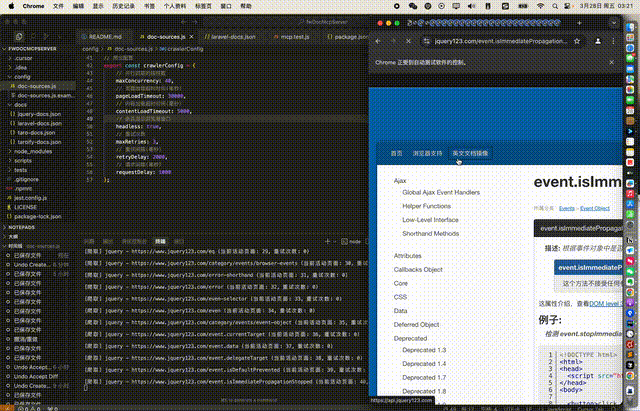
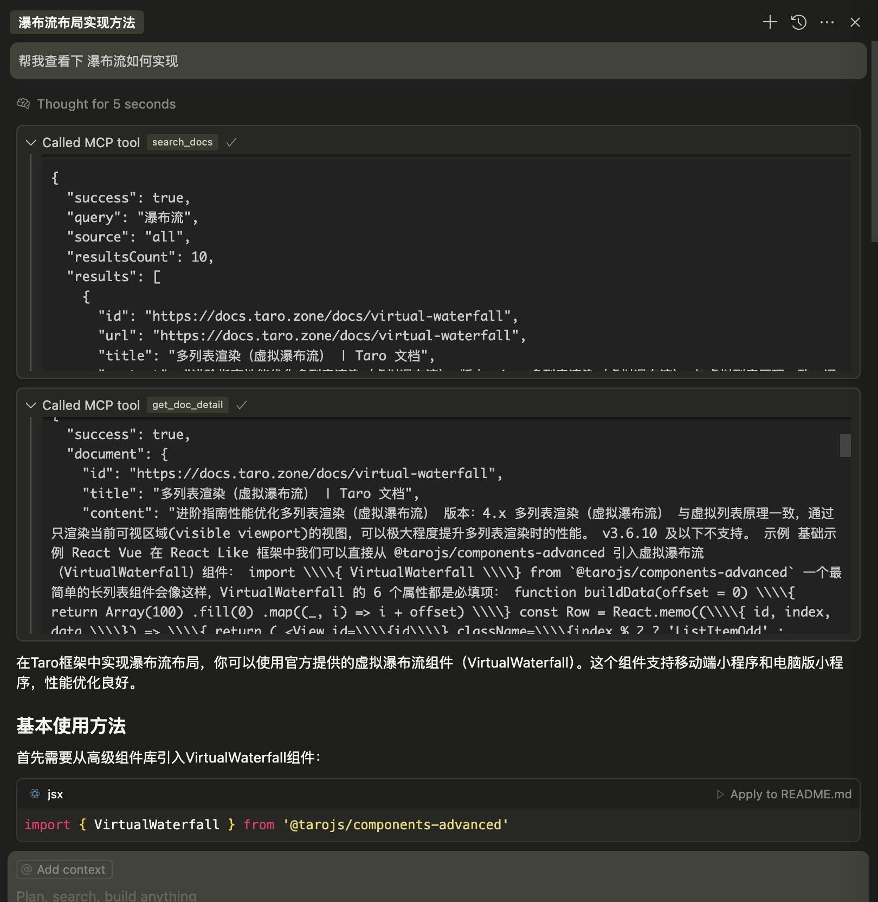

# McpDocServer

[English Documentation](README_EN.md)

一个基于MCP协议的开发文档服务器，专为各类开发框架文档设计。提供文档多线程爬取、本地文档加载、关键词搜索和文档详情获取功能。

## 核心功能演示

### 1. 文档爬取演示



*从配置到执行`npm run crawl`的完整文档爬取过程*

### 2. MCP服务器调用演示



*在Cursor中查询API并获取准确文档结果的过程*


## 解决Cursor幻觉问题

在使用Cursor进行各类框架开发时，经常会遇到AI对框架API不够精确的理解，导致的"幻觉"问题：

- **准确性问题**：AI可能推荐不存在或已过时的框架API和组件
- **版本混淆**：混合不同版本的API文档，导致代码无法正常运行
- **参数错误**：对方法参数的理解不准确，特别是针对框架特有功能
- **兼容性误判**：无法准确判断某个API在不同环境或平台中的兼容性

本MCP服务器通过提供精确的文档检索能力，有效解决上述问题：

- **实时精准查询**：直接从官方文档源获取最新准确的API信息
- **上下文关联**：将相关API和组件文档关联展示，提供完整参考
- **参数精确匹配**：提供完整的方法签名和参数列表，消除参数错误
- **跨平台兼容标记**：明确标识API在不同平台的兼容性
- **示例代码**：提供官方示例代码，确保用法正确

通过集成此MCP服务器，可以显著提高Cursor在各类框架开发过程中的准确性和效率，避免"幻觉"带来的开发障碍。

## 功能特点

- 支持从本地 JSON 文件加载框架文档数据
- 提供强大的文档搜索功能
- 提供文档详情查询
- 自动识别可用文档源
- 支持特定文档源的定向查询
- 支持爬取外部文档，自动转换为本地可用格式
- 支持重新加载文档（通过搜索"reload"触发）

## 目录结构

```
/
├── server.js              # 服务器入口文件
├── docs/                  # 文档数据目录
│   ├── taro-docs.json     # Taro框架文档
│   └── taroify-docs.json  # Taroify组件库文档
├── scripts/               # 脚本目录
│   └── crawl.js           # 文档爬取脚本
├── tests/                 # 测试目录
│   └── mcp.test.js        # MCP测试脚本
├── config/                # 配置文件目录
│   └── doc-sources.js     # 文档源配置
└── package.json           # 项目配置
```


### 安装和运行

如果你本地已经安装了 Chrome 浏览器，并且希望 puppeteer 使用你已有的版本，可以设置 PUPPETEER_SKIP_DOWNLOAD 环境变量：

macOS/Linux:
```bash
export PUPPETEER_SKIP_DOWNLOAD=true
npm install
```

Windows (命令提示符):
```bash
set PUPPETEER_SKIP_DOWNLOAD=true
npm install
```

Windows (PowerShell):
```bash
$env:PUPPETEER_SKIP_DOWNLOAD = $true
npm install
```


2. 爬取文档数据

爬虫用于获取框架文档，是使用服务器前的重要步骤。您需要先创建爬虫配置文件，然后运行爬虫脚本。

### 创建爬虫配置

在 `config` 目录中创建 `doc-sources.js` 文件，参照以下格式：

```javascript
// config/doc-sources.js

// 文档源配置
export const docSources = [
    {
        // 文档源名称 - 会用作搜索时的source参数
        name: "taro",
        // 文档网站基础URL
        url: "https://docs.taro.zone/docs",
        // 包含模式 - 指定要爬取的URL路径（空数组表示所有页面）
        includePatterns: [
        ],
        // 排除模式 - 指定不爬取的URL路径（支持正则表达式）
        excludePatterns: [
            /\d\.x/,   // 排除版本号页面
            /apis/     // 排除API页面
        ]
    },
    {
        name: "taroify",
        url: "https://taroify.github.io/taroify.com/introduce/",
        includePatterns: [
            "/components/",          // 所有组件页面
            "/components/*/",        // 组件子页面
            "/components/*/*/"       // 组件子子页面
        ],
        excludePatterns: []
    },
    {
        name: "jquery",
        url: "https://www.jquery123.com/",
        includePatterns: [],         // 空数组表示爬取所有页面
        excludePatterns: [
            /version/               // 排除版本相关页面
        ]
    }
];

// 爬虫全局配置
export const crawlerConfig = {
    // 并行抓取的线程数
    maxConcurrency: 40,
    // 页面加载超时时间(毫秒)
    pageLoadTimeout: 30000,
    // 内容加载超时时间(毫秒)
    contentLoadTimeout: 5000,
    // 是否显示浏览器窗口（false为无界面模式）
    headless: false,
    // 重试次数
    maxRetries: 3,
    // 重试间隔(毫秒)
    retryDelay: 2000,
    // 请求间隔(毫秒)
    requestDelay: 1000
};
```

### 运行爬虫

配置完成后，执行以下命令启动爬虫：

```bash
npm run crawl
```

爬虫会按照配置自动爬取指定的文档网站，并将结果保存为符合MCP服务器要求的JSON格式。

### 爬虫输出示例

爬虫完成后，会在 `docs` 目录生成以下格式的JSON文件：

```javascript
{
  "source": {
    "name": "taro",
    "url": "https://docs.taro.zone/docs"
  },
  "lastUpdated": "2024-05-20T12:00:00.000Z",
  "pages": {
    "https://docs.taro.zone/docs/components-desc": {
      "title": "组件库说明 | Taro 文档",
      "content": "页面内容...",
      "lastCrawled": "2024-05-20T12:00:00.000Z"
    },
    "https://docs.taro.zone/docs/components/viewcontainer/view": {
      "title": "View | Taro 文档",
      "content": "View 组件是一个容器组件...",
      "lastCrawled": "2024-05-20T12:00:00.000Z"
    }
    // ... 更多页面
  }
}
```

### 自定义爬虫

如需自定义爬虫行为，可以修改 `scripts/crawl.js` 文件。您可以添加特定网站的解析逻辑、自定义内容处理或增强爬取能力。

3. 启动MCP服务器
```bash
npm start
```
启动后，服务器会检测和加载docs目录下的文档文件，并通过MCP协议提供接口服务。服务器会输出加载的文档源信息和页面数量。

4. 运行测试
```bash
npm test
```
执行测试脚本，验证MCP服务器的基本功能和接口正常工作。

## 文档格式

文档文件应该是一个 JSON 文件，包含以下结构：

```javascript
{
  "source": {
    "name": "taro",
    "url": "https://docs.taro.zone/docs"
  },
  "lastUpdated": "2024-03-27T12:00:00.000Z",
  "pages": {
    "https://docs.taro.zone/docs/components-desc": {
      "title": "组件库说明 | Taro 文档",
      "content": "页面内容..."
    },
    // 更多页面...
  }
}
```

文档加载流程：
1. 服务器启动时会自动检测并加载 `docs` 目录下的JSON文件
2. 如果项目目录下没有找到文档，会尝试从当前工作目录加载
3. 页面ID默认使用URL作为键，无需额外指定url字段
4. 所有源名称会自动转为小写以确保一致性

## 爬虫功能

系统内置爬虫支持从各类框架官方文档站点抓取内容并转换为本地可用的文档格式。爬虫特性包括：

1. **多站点支持**：支持任意框架和库的文档网站，完全可配置
2. **选择性爬取**：可以配置包含和排除模式，精确控制需要爬取的内容
3. **智能内容提取**：自动识别文档页面的标题、正文内容和结构
4. **多线程爬取**：支持高并发爬取，提高效率
5. **自动转换**：将爬取内容转换为标准的文档JSON格式
6. **容错机制**：提供超时处理和重试机制，增强稳定性

## MCP 工具

服务器提供以下 MCP 工具：

1. `search_docs` - 搜索文档
   - 参数:
     - `query`: 搜索关键词 (字符串, 必须)
     - `source`: 文档源名称 (字符串, 可选)
     - `limit`: 最大结果数量 (数字, 可选, 默认10)
   - 特殊功能: 
     - 当query为"reload"时，会触发重新加载文档

2. `get_doc_detail` - 获取文档详情
   - 参数:
     - `id`: 文档ID (字符串, 必须)
     - `source`: 文档源名称 (字符串, 可选)

## 使用示例

```javascript
// 搜索文档
const searchRequest = {
  jsonrpc: "2.0",
  id: "search1",
  method: "tools/call",
  params: {
    name: "search_docs",
    arguments: { 
      query: "组件", 
      source: "taro", 
      limit: 5 
    }
  }
};

// 获取文档详情
const detailRequest = {
  jsonrpc: "2.0",
  id: "detail1",
  method: "tools/call",
  params: {
    name: "get_doc_detail",
    arguments: { 
      id: "https://docs.taro.zone/docs/components-desc", 
      source: "taro" 
    }
  }
};

// 重新加载文档
const reloadRequest = {
  jsonrpc: "2.0",
  id: "reload1",
  method: "tools/call",
  params: {
    name: "search_docs",
    arguments: { 
      query: "reload" 
    }
  }
};
```

## 配置Cursor

要在 Cursor 中使用该服务器，需要添加以下配置到 `mcp.json`：

```json
{
  "mcpServers": {
    "文档 MCP 服务器": {
      "command": "node",
      "args": ["/绝对路径/server.js"],
      "env": { "NODE_ENV": "development" }
    }
  }
}
```

> 注意: 请确保使用服务器文件的完整绝对路径，而不是相对路径。服务器启动时会自动输出适用于Cursor的配置示例。

## 测试

项目包含自动化测试，可以通过以下命令运行：

```bash
npm test
```

测试会检查服务器的基本功能：
- 初始化 MCP 服务器
- 调用搜索工具
- 调用文档详情工具 

## 未来计划

项目正在持续开发中，以下是我们计划添加的功能：

1. **本地文档加载** - 添加对本地文档文件的直接加载和解析，无需依赖网络资源
2. **国际化支持** - 添加对多语言文档的支持

如果您有功能建议或发现问题，欢迎提交Issue或Pull Request。

