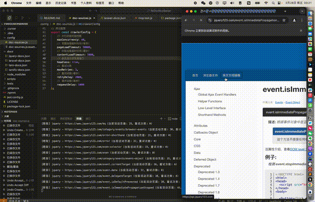
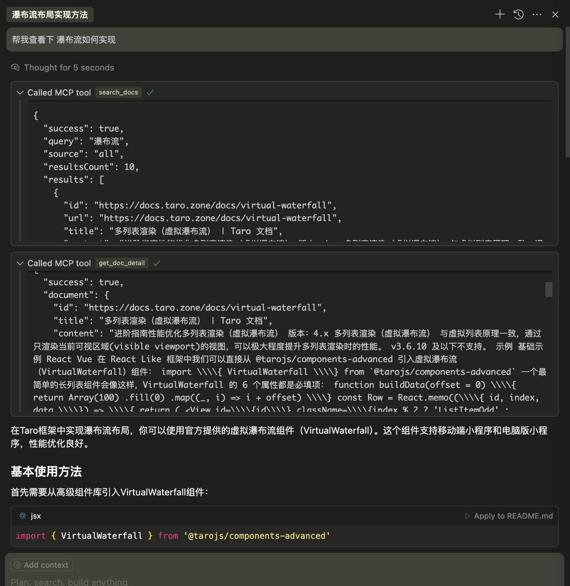

# McpDocServer

A MCP protocol-based development documentation server designed for various development framework documentation. It provides multi-threaded document crawling, local document loading, keyword search, and document detail retrieval functionality.

## Core Features Demonstration

### 1. Document Crawling Demo



*Complete document crawling process from configuration to executing `npm run crawl`*

### 2. MCP Server Call Demo



*Process of querying API and obtaining accurate documentation results in Cursor*

## Solving Cursor's Hallucination Issues

When using Cursor for framework development, AI often encounters "hallucination" problems due to imprecise understanding of framework APIs:

- **Accuracy Issues**: AI might recommend non-existent or outdated framework APIs and components
- **Version Confusion**: Mixing APIs from different versions, leading to non-functional code
- **Parameter Errors**: Inaccurate understanding of method parameters, especially for framework-specific features
- **Compatibility Misjudgment**: Unable to accurately determine API compatibility across different environments or platforms

This MCP server effectively solves these issues by providing precise documentation retrieval:

- **Real-time Precise Queries**: Direct access to the latest accurate API information from official documentation
- **Context Association**: Related API and component documentation displayed together for complete reference
- **Precise Parameter Matching**: Complete method signatures and parameter lists to eliminate parameter errors
- **Cross-platform Compatibility Markers**: Clear identification of API compatibility across platforms
- **Example Code**: Official example code provided to ensure correct usage

By integrating this MCP server, you can significantly improve Cursor's accuracy and efficiency in framework development, avoiding development obstacles caused by "hallucinations".

## Features

- Support for loading framework documentation data from local JSON files
- Powerful documentation search functionality
- Document detail query
- Automatic recognition of available documentation sources
- Support for targeted queries of specific documentation sources
- Support for crawling external documentation, automatically converting to locally usable format
- Support for documentation reloading (triggered by searching "reload")

## Directory Structure

```
/
├── server.js              # Server entry file
├── docs/                  # Documentation data directory
│   ├── taro-docs.json     # Taro framework documentation
│   └── taroify-docs.json  # Taroify component library documentation
├── scripts/               # Scripts directory
│   └── crawl.js           # Documentation crawling script
├── tests/                 # Test directory
│   └── mcp.test.js        # MCP test script
├── config/                # Configuration files directory
│   └── doc-sources.js     # Documentation source configuration
└── package.json           # Project configuration
```

### Installation and Running

If you have Chrome browser installed locally and want puppeteer to use your existing version, you can set the PUPPETEER_SKIP_DOWNLOAD environment variable:

macOS/Linux:
```bash
export PUPPETEER_SKIP_DOWNLOAD=true
npm install
```

Windows (Command Prompt):
```bash
set PUPPETEER_SKIP_DOWNLOAD=true
npm install
```

Windows (PowerShell):
```bash
$env:PUPPETEER_SKIP_DOWNLOAD = $true
npm install
```

### Creating Crawler Configuration

Create a `doc-sources.js` file in the `config` directory following this format:

```javascript
// config/doc-sources.js

// Documentation source configuration
export const docSources = [
    {
        // Documentation source name - used as source parameter when searching
        name: "taro",
        // Documentation website base URL
        url: "https://docs.taro.zone/docs",
        // Include patterns - specify URL paths to crawl (empty array means all pages)
        includePatterns: [
        ],
        // Exclude patterns - specify URL paths not to crawl (supports regular expressions)
        excludePatterns: [
            /\d\.x/,   // Exclude version number pages
            /apis/     // Exclude API pages
        ]
    }
    // ... more sources
];

// Crawler global configuration
export const crawlerConfig = {
    maxConcurrency: 40,
    pageLoadTimeout: 30000,
    contentLoadTimeout: 5000,
    headless: false,
    maxRetries: 3,
    retryDelay: 2000,
    requestDelay: 1000
};
```

### Running the Crawler

After configuration, execute the following command to start the crawler:

```bash
npm run crawl
```

### Starting the MCP Server
```bash
npm start
``` 